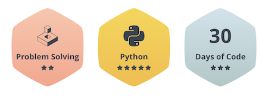

# HackerRank
My HackerRank solutions and challenges

---

 

## 30 Days of Code ⏳

 

| No | Question Name | Difficulty | Score | Solution(s) | Subject | HR Link |
|--|--|--|--|--|--|--|
| 0 | [**Day 0 : Hello, World**](https://github.com/hevalhazalkurt/Hackerrank_Python_Solutions/blob/master/solutions/Day_0-Hello_World.md) | Easy | 30 | 1 | `str` | [link](https://www.hackerrank.com/challenges/30-hello-world/problem) |
| 1 | [**Day 1 : Data Types**](https://github.com/hevalhazalkurt/Hackerrank_Python_Solutions/blob/master/solutions/Day_1_Data_Types.md) | Easy | 30 | 1 | `str`, `int`, `float`, `data types` | [link](https://github.com/hevalhazalkurt/Hackerrank_Python_Solutions/blob/master/solutions/Day_1_Data_Types.md) |
| 2 | [**Day 2 : Operators**](https://github.com/hevalhazalkurt/Hackerrank_Python_Solutions/blob/master/solutions/Day_2_Operators.md) | Easy | 30 | 3 | `int`, `float`, `variables`, `arithmetic` | [link](https://www.hackerrank.com/challenges/30-operators/problem) |
| 3 | [**Day 3 : Intro to Conditional Statements**](https://github.com/hevalhazalkurt/Hackerrank_Python_Solutions/blob/master/solutions/Day_3_Intro_to_Conditional_Statements.md) | Easy | 30 | 4 | `if-elif-else`, `conditionals`, `logicals` | [link](https://www.hackerrank.com/challenges/30-conditional-statements/problem) |
| 4 | [**Day 4 : Class vs. Instance**](https://github.com/hevalhazalkurt/Hackerrank_Python_Solutions/blob/master/solutions/Day_4_Class_vs_Instance.md) | Easy | 30 | 2 | `class`  | [link](https://www.hackerrank.com/challenges/30-class-vs-instance/problem) |
| 5 | [**Day 5 : Loops**](https://github.com/hevalhazalkurt/Hackerrank_Python_Solutions/blob/master/solutions/Day_5_Loops.md) | Easy | 30 | 4 | `for`, `loops` | [link](https://www.hackerrank.com/challenges/30-loops/problem) |
| 6 | [**Day 6 : Let's Review**](https://github.com/hevalhazalkurt/Hackerrank_Python_Solutions/blob/master/solutions/Day_6_Lets_Review.md) | Easy | 30 | 3 | `str`, `manipulations` | [link](https://www.hackerrank.com/challenges/30-review-loop/problem) |
| 7 | [**Day 7 : Arrays**](https://github.com/hevalhazalkurt/Hackerrank_Python_Solutions/blob/master/solutions/Day_7_Arrays.md) | Easy | 30 | 3 | `array`, `list`, `sorting`, `data structures` | [link](https://www.hackerrank.com/challenges/30-arrays/problem) |
| 8 | [**Day 8 : Dictionaries and Maps**](https://github.com/hevalhazalkurt/Hackerrank_Python_Solutions/blob/master/solutions/Day_8_Dictionaries_and_Maps.md) | Easy | 30 | 4 | `dict`, `mapping`, `hash tables` `data structures` | [link](https://www.hackerrank.com/challenges/30-dictionaries-and-maps/problem) |
| 9 | [**Day 9 : Recursion 3**](https://github.com/hevalhazalkurt/Hackerrank_Python_Solutions/blob/master/solutions/Day_9_Recursion_3.md) | Easy | 30 | 2 | `recursion`, `math`, `operators` | [link](https://www.hackerrank.com/challenges/30-recursion/problem) |
| 10 | [**Day 10 : Binary Numbers**](https://github.com/hevalhazalkurt/Hackerrank_Python_Solutions/blob/master/solutions/Day_10_Binary_Numbers.md) | Easy | 30 | 3 | `bin`, `int` | [link](https://www.hackerrank.com/challenges/30-binary-numbers/problem) |
| 11 | [**Day 11 : 2D Arrays**](https://github.com/hevalhazalkurt/Hackerrank_Python_Solutions/blob/master/solutions/Day_11_2D_Arrays.md) | Easy | 30 | 3 | `array`, `list`, `matrix` | [link](https://www.hackerrank.com/challenges/30-2d-arrays/problem) |
| 12 | [**Day 12 : Inheritance**](https://github.com/hevalhazalkurt/Hackerrank_Python_Solutions/blob/master/solutions/Day_12_Inheritance.md) | Easy | 30 | 1 | `class`, `oop` | [link](https://www.hackerrank.com/challenges/30-inheritance/problem) |
| 13 | [**Day 13 : Abstract Classes**](https://github.com/hevalhazalkurt/Hackerrank_Python_Solutions/blob/master/solutions/Day_13_Abstract_Classes.md) | Easy | 30 | 1 | `class`, `oop` | [link](https://www.hackerrank.com/challenges/30-abstract-classes/problem) |
| 14 | [**Day 14 : Scope**](https://github.com/hevalhazalkurt/Hackerrank_Python_Solutions/blob/master/solutions/Day_14-Scope.md) | Easy | 30 | 1 | `function`, `scope` | [link](https://www.hackerrank.com/challenges/30-scope/problem) |
| 15 | [**Day 15 : Linked List**](https://github.com/hevalhazalkurt/Hackerrank_Python_Solutions/blob/master/solutions/Day_15_Linked_List.md) | Easy | 30 | 1 | `linked list`, `class`, `oop` | [link](https://www.hackerrank.com/challenges/30-linked-list/problem) |
| 16 | [**Day 16 : Exceptions - String to Integer**](https://github.com/hevalhazalkurt/Hackerrank_Python_Solutions/blob/master/solutions/Day_16_Exceptions_String_to_Integer.md) | Easy | 30 | 1 | `exception` | [link](https://www.hackerrank.com/challenges/30-exceptions-string-to-integer/problem) |
| 17 | [**Day 17 : More Exceptions**](https://github.com/hevalhazalkurt/Hackerrank_Python_Solutions/blob/master/solutions/Day_17_More_Exceptions.md) | Easy | 30 | 1 | `exception` | [link](https://www.hackerrank.com/challenges/30-more-exceptions/problem) |
| 18 | [**Day 18 : Queues and Stacks**](https://github.com/hevalhazalkurt/Hackerrank_Python_Solutions/blob/master/solutions/Day_18_Queues_and_Stacks.md) | Easy | 30 | 2 | `queue`, `stack`, `class`, `oop` | [link](https://www.hackerrank.com/challenges/30-queues-stacks/problem) |
| 19 | [**Day 19 : Interfaces**](https://github.com/hevalhazalkurt/Hackerrank_Python_Solutions/blob/master/solutions/Day_19_Interfaces.md) | Easy | 30 | 1 | `interface`, `class`, `oop` | [link](https://www.hackerrank.com/challenges/30-interfaces/problem) |
| 20 | [**Day 20 : Sorting**](https://github.com/hevalhazalkurt/Hackerrank_Python_Solutions/blob/master/solutions/Day_20_Sorting.md) | Easy | 30 | 1 | `swap`, `sort`, `bubble sort` | [link](https://www.hackerrank.com/challenges/30-sorting/problem) |

 

---

 

## The HackerRank Interview Preparation Kit

 

| No | Question Name | Difficulty | Score | Solution(s) | Subject | HR Link |
|--|--|--|--|--|--|--|
|  |  |  |  |  |  |  |
| **1** | **Warm-up Challenges** |  |  |  |  |  |
| 1.1. | [**Sock Merchant**](https://github.com/hevalhazalkurt/Hackerrank_Python_Solutions/blob/master/solutions/1_1_Sock_Merchant.md) | Easy | 10 | 1 | `hashmap`, `dict` | [link](https://www.hackerrank.com/challenges/sock-merchant/problem) |
| 1.2. | [**Counting Valleys**](https://github.com/hevalhazalkurt/Hackerrank_Python_Solutions/blob/master/solutions/1_2_Counting_Valleys.md) | Easy | 15 | 1 | `array`, `list` | [link](https://www.hackerrank.com/challenges/counting-valleys/problem) |
| 1.3. | [**Jumping on the Clouds**](https://github.com/hevalhazalkurt/Hackerrank_Python_Solutions/blob/master/solutions/1_3_Jumping_on_the_Clouds.md) | Easy | 20 | 1 | `array`, `list`, | [link](https://www.hackerrank.com/challenges/jumping-on-the-clouds/problem) |
| 1.4. | [**Repeated String**](https://github.com/hevalhazalkurt/Hackerrank_Python_Solutions/blob/master/solutions/1_4_Repeated_String.md) | Easy | 20 | 1 | `str` | [link](https://www.hackerrank.com/challenges/repeated-string/problem) |
|  |  |  |  |  |  |  |
| **2** | **Arrays** |  |  |  |  |  |
| 2.1. | [**2D Array - DS**](https://github.com/hevalhazalkurt/Hackerrank_Python_Solutions/blob/master/solutions/2_1_2D_Array_DS.md) | Easy | 15 | 1 | `array`, `list`, `matrix` | [link](https://www.hackerrank.com/challenges/2d-array/problem) |
| 2.2. | [**Arrays: Left Rotation**](https://github.com/hevalhazalkurt/Hackerrank_Python_Solutions/blob/master/solutions/2_2_Arrays_Left_Rotation.md) | Easy | 20 | 1 | `array`, `list`, `sort` | [link](https://www.hackerrank.com/challenges/ctci-array-left-rotation/problem) |
| 2.3. | [**New Year Chaos**](https://github.com/hevalhazalkurt/Hackerrank_Python_Solutions/blob/master/solutions/2_3_New_Year_Chaos.md) | Medium | 40 | 1 | `array`, `list`, `swap` | [link](https://www.hackerrank.com/challenges/new-year-chaos/problem) |
| 2.4. | [**Minimum Swaps 2**](https://github.com/hevalhazalkurt/Hackerrank_Python_Solutions/blob/master/solutions/2_4_Minimum_Swaps_2.md) | Medium | 40 | 1 | `array`, `list`, `swap` | [link](https://www.hackerrank.com/challenges/minimum-swaps-2/problem) |
|  |  |  |  |  |  |  |
| **3** | **Dictionaries and Hashmaps** |  |  |  |  |  |
| 3.1. | [**Hash Tables: Ransom Note**](https://github.com/hevalhazalkurt/Hackerrank_Python_Solutions/blob/master/solutions/3_1_Hash_Tables_Ransom_Note.md) | Easy | 25 | 1 | `hashmap`, `dict` | [link](https://www.hackerrank.com/challenges/ctci-ransom-note/problem) |

 

----

 

## Python Language Proficiency ⏳

 

| No | Question Name | Difficulty | Score | Solution(s) | Subject | HR Link |
|--|--|--|--|--|--|--|
| 1 | [**Say "Hello, World!" With Python**](https://github.com/hevalhazalkurt/Hackerrank_Python_Solutions/blob/master/solutions/001_Say_Hello_World_With_Python.md) | Easy | 5 | 1 | `str` | [link](https://www.hackerrank.com/challenges/py-hello-world/problem) |
| 2 | [**Python If-Else**](https://github.com/hevalhazalkurt/Hackerrank_Python_Solutions/blob/master/solutions/002_Python_If_Else.md) | Easy | 10 | 2 | `if-elif-else`, `conditionals`, `control flow` | [link](https://www.hackerrank.com/challenges/py-if-else/problem) |
| 3 | [**Arithmetic Operators**](https://github.com/hevalhazalkurt/Hackerrank_Python_Solutions/blob/master/solutions/003_Arithmetic_Operators.md) | Easy | 10 | 2 | `math`, `operators` | [link](https://www.hackerrank.com/challenges/python-arithmetic-operators/problem) |
| 4 | [**Division**](https://github.com/hevalhazalkurt/Hackerrank_Python_Solutions/blob/master/solutions/004_Division.md) | Easy | 10 | 2 | `math`, `operators`, `data types` | [link](https://www.hackerrank.com/challenges/python-division/problem) |
| 5 | [**Loops**](https://github.com/hevalhazalkurt/Hackerrank_Python_Solutions/blob/master/solutions/005_Loops.md) | Easy | 10 | 2 | `loops`, `for`, `while` | [link](https://www.hackerrank.com/challenges/python-loops/problem) |
| 6 | [**Write a function**](https://github.com/hevalhazalkurt/Hackerrank_Python_Solutions/blob/master/solutions/006_Write_a_function.md) | Medium | 10 | 2 | `function` | [link](https://www.hackerrank.com/challenges/write-a-function/problem) |
| 7 | [**Print Function**](https://github.com/hevalhazalkurt/Hackerrank_Python_Solutions/blob/master/solutions/007_Print_Function.md) | Easy | 20 | 5 | `array`, `list`, `loops` | [link](https://www.hackerrank.com/challenges/python-print) |
| 8 | [**List Comprehensions**](https://github.com/hevalhazalkurt/Hackerrank_Python_Solutions/blob/master/solutions/008_List_Comprehensions.md) | Easy | 10 | 2 | `array`, `list`, `matrix`, `list comprehension`, `data types` | [link](https://www.hackerrank.com/challenges/list-comprehensions/problem) |
| 9 | [**Find the Runner-Up Score**](https://github.com/hevalhazalkurt/Hackerrank_Python_Solutions/blob/master/solutions/009_Find_the_Runner_Up_Score.md) | Easy | 10 | 1 | `array`, `list`, `sort`, `data types` | [link](https://www.hackerrank.com/challenges/find-second-maximum-number-in-a-list/problem) |
| 10 | [**Nested Lists**](https://github.com/hevalhazalkurt/Hackerrank_Python_Solutions/blob/master/solutions/010_Nested_Lists.md) | Easy | 10 | 1 | `array`, `list`, `nested list`, `sort`, `data types` | [link](https://www.hackerrank.com/challenges/nested-list/problem) |
| 11 | [**Finding The Percentage**](https://github.com/hevalhazalkurt/Hackerrank_Python_Solutions/blob/master/solutions/011_Finding_The_Percentage.md) | Easy | 10 | 1 | `hashmap`, `dict`, `data types` | [link](https://www.hackerrank.com/challenges/finding-the-percentage) |
| 12 | [**Lists**](https://github.com/hevalhazalkurt/Hackerrank_Python_Solutions/blob/master/solutions/012_Lists.md) | Easy | 10 | 1 | `array`, `list`, `data types` | [link](https://www.hackerrank.com/challenges/python-lists) |
| 13 | [**Tuples**](https://github.com/hevalhazalkurt/Hackerrank_Python_Solutions/blob/master/solutions/013_Tuples.md) | Easy | 10 | 1 | `tuple`, `data types` | [link](https://www.hackerrank.com/challenges/python-tuples/problem) |
| 14 | [**sWAP cASE**](https://github.com/hevalhazalkurt/Hackerrank_Python_Solutions/blob/master/solutions/014_sWAP_cASE.md) | Easy | 10 | 1 | `str`, `swap` | [link](https://www.hackerrank.com/challenges/swap-case) |
| 15 | [**String Split and Join**](https://github.com/hevalhazalkurt/Hackerrank_Python_Solutions/blob/master/solutions/015_String_Split_and_Join.md) | Easy | 10 | 1 | `array`, `list` | [link](https://www.hackerrank.com/challenges/python-string-split-and-join/problem) |
| 16 | [**What's Your Name?**](https://github.com/hevalhazalkurt/Hackerrank_Python_Solutions/blob/master/solutions/016_What_s_Your_Name.md) | Easy | 10 | 1 | `str`, `format` | [link](https://www.hackerrank.com/challenges/whats-your-name) |
| 17 | [**Mutations**](https://github.com/hevalhazalkurt/Hackerrank_Python_Solutions/blob/master/solutions/017_Mutations.md) | Easy | 10 | 1 | `str`, `manipulations` | [link](https://www.hackerrank.com/challenges/python-mutations/problem) |
| 18 | [**Find a string**](https://github.com/hevalhazalkurt/Hackerrank_Python_Solutions/blob/master/solutions/018_Find_a_string.md) | Easy | 10 | 1 | `str` | [link](https://www.hackerrank.com/challenges/find-a-string/problem) |
| 19 | [**String Validators**](https://github.com/hevalhazalkurt/Hackerrank_Python_Solutions/blob/master/solutions/019_String_Validators.md) | Easy | 10 | 1 | `str`, `validation` | [link](https://www.hackerrank.com/challenges/string-validators/problem) |
| 20 | [**Text Alignment**](https://github.com/hevalhazalkurt/Hackerrank_Python_Solutions/blob/master/solutions/020_Text_Alignment.md) | Easy | 10 | 1 | `str`, `format` | [link](https://www.hackerrank.com/challenges/text-alignment/problem) |
| 21 | [**Text Wrap**](https://github.com/hevalhazalkurt/Hackerrank_Python_Solutions/blob/master/solutions/021_Text_Wrap.md) | Easy | 10 | 1 | `str`, `format` | [link](https://www.hackerrank.com/challenges/text-wrap) |
| 22 | [**Designer Door Mat**](https://github.com/hevalhazalkurt/Hackerrank_Python_Solutions/blob/master/solutions/022_Designer_Door_Mat.md) | Easy | 10 | 1 | `str`, `format` | [link](https://www.hackerrank.com/challenges/designer-door-mat/problem) |
| 23 | [**String Formatting**](https://github.com/hevalhazalkurt/Hackerrank_Python_Solutions/blob/master/solutions/022_String_Formatting.md) | Easy | 10 | 2 | `str`, `format` | [link](https://www.hackerrank.com/challenges/python-string-formatting/problem) |
| 24 | [**Alphabet_Rangoli**](https://github.com/hevalhazalkurt/Hackerrank_Python_Solutions/blob/master/solutions/023_Alphabet_Rangoli.md) | Easy | 20 | 1 | `str`, `format` | [link](https://www.hackerrank.com/challenges/alphabet-rangoli/problem) |
| 25 | [**Capitalize**](https://github.com/hevalhazalkurt/Hackerrank_Python_Solutions/blob/master/solutions/024_Capitalize.md) | Easy | 20 | 1 | `str`, `format` | [link](https://www.hackerrank.com/challenges/capitalize/problem) |
| 26 | [**The Minion Game**](https://github.com/hevalhazalkurt/Hackerrank_Python_Solutions/blob/master/solutions/025_The_Minion_Game.md) | Medium | 40 | 1 | `str` | [link](https://www.hackerrank.com/challenges/the-minion-game/problem) |
| 30 | [**collections.Counter()**](https://github.com/hevalhazalkurt/Hackerrank_Python_Solutions/blob/master/solutions/030_collections_Counter.md) | Easy | 10 | 1 | `hashmap`, `dict`, `data types`, `collections` | [link](https://www.hackerrank.com/challenges/collections-counter/problem) |
| 31 | [**itertools.permutations()**](https://github.com/hevalhazalkurt/Hackerrank_Python_Solutions/blob/master/solutions/031_itertools_permutations.md) | Easy | 10 | 1 | `hashmap`, `dict`, `data types`, `itertools`, `permutation` | [link](https://www.hackerrank.com/challenges/itertools-permutations/problem) |
| 34 | [**DefaultDict Tutorial**](https://github.com/hevalhazalkurt/Hackerrank_Python_Solutions/blob/master/solutions/034_DefaultDict_Tutorial.md) | Easy | 20 | 1 | `hashmap`, `dict`, `data types`, `collections`, `defaultdict` | [link](https://www.hackerrank.com/challenges/defaultdict-tutorial/problem) |
| 37 | [**Collections.namedtuple()**](https://github.com/hevalhazalkurt/Hackerrank_Python_Solutions/blob/master/solutions/037_Collections_namedtuple.md) | Easy | 20 | 1 | `hashmap`, `collections`, `namedtuple` | [link](https://www.hackerrank.com/challenges/py-collections-namedtuple/problem) |

 

----

 

## Contests ⏳

 

| No | Question Name | Difficulty | Score | Solution(s) | Subject | HR Link |
|--|--|--|--|--|--|--|
| 1 | [**appSMART : Python One**](https://github.com/hevalhazalkurt/Hackerrank_Python_Solutions/blob/master/solutions/1_appsmart_Python_Dictionary.md) | Hard | 50 | 1 | `str`, `array`, `list`, `sort` | [link](https://www.hackerrank.com/contests/python-start-up/challenges/day-10-dictionary) |
| 2 | [**Pycode2015 : Dictionary-Assignment**](https://github.com/hevalhazalkurt/Hackerrank_Python_Solutions/blob/master/solutions/2_Pycode2015_Dictionary_Assignment.md) | Medium | 100 | 2 | `hashmap`, `dict`, `str`, `format` | [link](https://www.hackerrank.com/contests/pycode2015/challenges/dictionary-assignment/problem) |
